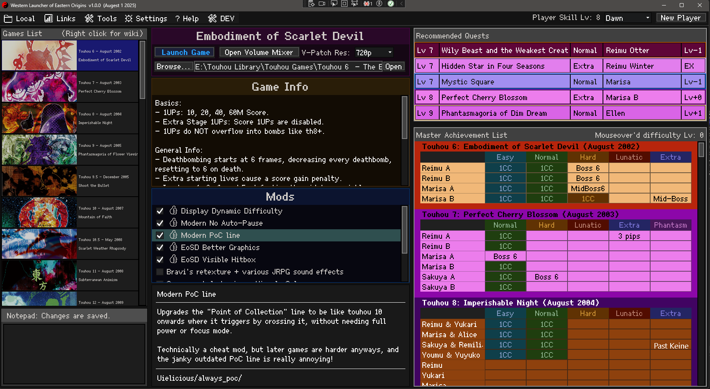

# Touhou Western Launcher of Eastern Origins

An extremely high quality touhou game launcher that completely crushes all the others.
- Full support for all official touhou games, AND support for the fan series' Len'en and Kaisendou, and various fangames to!
- Full achievement tracking! Get an overview of all your 1CCs and slowly improve as a player!
- Each achievement has a difficulty Lv! Hover your mouse on a achievement to see how hard it is!
- The "Quest Board"! Your top 6 achievements give you a Player Lv, and the quest board recommends challenges based on it!
- Super easy game modding! Toggle on any mods you like and click launch! that's it!
- Right click any game for a list of links, such as it's wiki or steam pages!
- Highly customizable with tons of settings, you can disable almost every part of it.
- Big QoL like a controller checker, automatic practice tool, and easily swap game resolution.
- Small QoL like a button to open volume mixer, a notepad to keep thoughts on, a tool to force borderless full screen mode, and more.
- You can type in the achievement box to track your NoBombNoMiss runs! ...or that your best run died in Stage 4 :(
- You don't have to use it, but it comes with a "Game Library" Folder to put all your touhou games inside. I recommend using it :3

HAVE FUUUUUN!!!!  
PS: If someone could make v-sync patches for all the latest games that would be great >_>

### [CLICK HERE TO DOWNLOAD THE LATEST BUILD](https://github.com/dawnbomb/WesternLauncherOfEasternOrigins/releases/latest)

### Angry nerd rant on modding and the touhou community:
My mod support is fantastic, and i'm quite proud of that. But.....like....oh my god.... i can see why no other game launcher has mod support, and why mods aren't even popular despite there being a ton of them and being a community with over 500 fangames. 

The only other modding tool (THCrap) is completely awful to mod games with. They aren't even allowed to give mods an actual description. They have to describe it as part of the name because THCrap will only show users the name of a mod and nothing else. Hell it even forces mods to apply to ALL of your games at the same time! It's ridiculous! (and yes, some mods do actually affect more then 1 game at the same time, and in different ways).  

I feel mad that THCrap mod support is as terrible as it is. I have never seen a community with a worse navigation of mods. How is it that they don't even have a way for mod makers to tag a mod with what games it's even for? It's completely ridiculous. I can't decide if i'm more mad AT the touhou community, or mad FOR the touhou community. X.X Well anyway my launcher should fix a lot of that, but i do hope THCrap seriously improves in the future. D:<

